# Build a CI/CD pipeline for a microservices application for different deployment

## Project workflow:

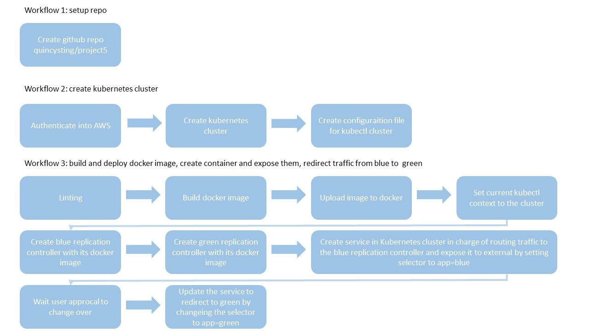

## Project environmet setup:

> PuTTY into instance ec2-54-188-126-103.us-west-2.compute.amazonaws.com and install:

* Jenkins with Blue Ocean and Pipeline-AWS
* Docker (pre-installed already)
* Pip
* AWSCli
* Eksctl 0.15.0
* Kubectl

## Project github files:
```sh
Branch create_cluster :
Jenkinsfile : pipeline for creating Kubernetes cluster

Branch master :
* /Images : Screenshots of project5 
* Jenkinsfile : pipeline for deploying container
* Dockerfile : Dockerfile for building the image 
* blue-controller.json : Create a replication controller blue pod
* blue-service.json : Create the blue service
* green-controller.json : Create a replication controller green pod
* green-service.json : Create the green service
* index.html : HTML file
```

## Project process:

1. Create EC2 instance

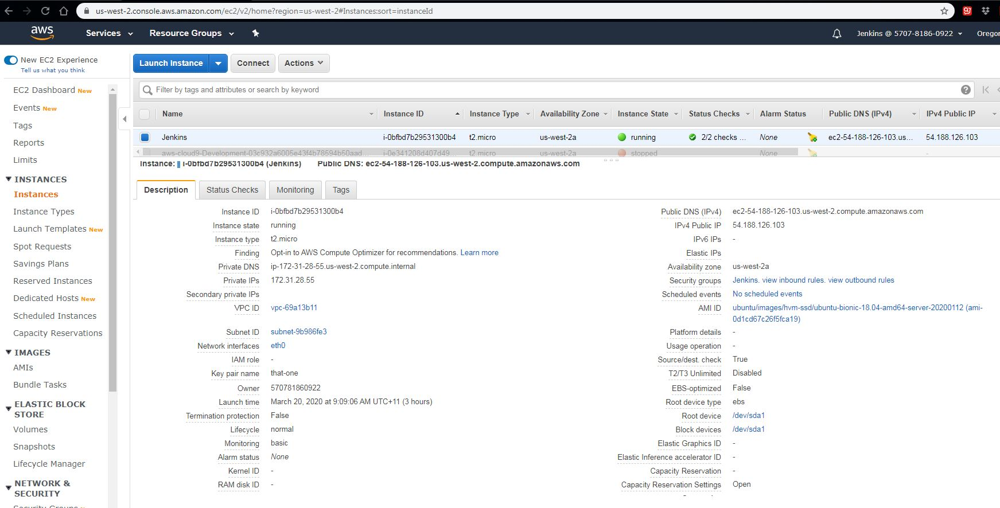

2. Setup Jenkins environment

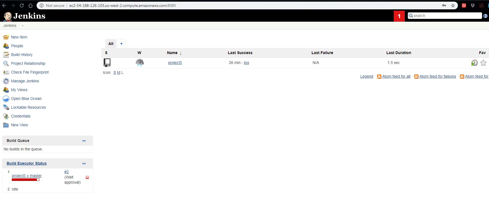

3. Create Kubernetes cluster pipeline

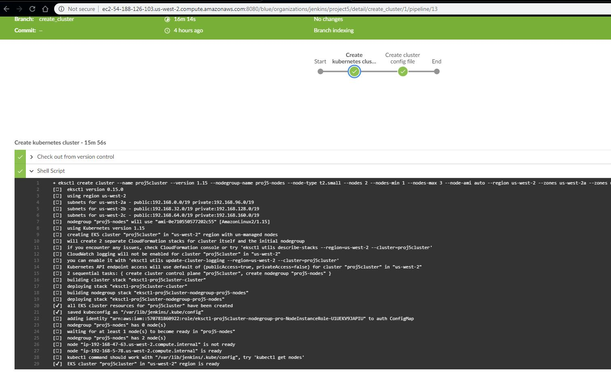

4. Create cluster configuration

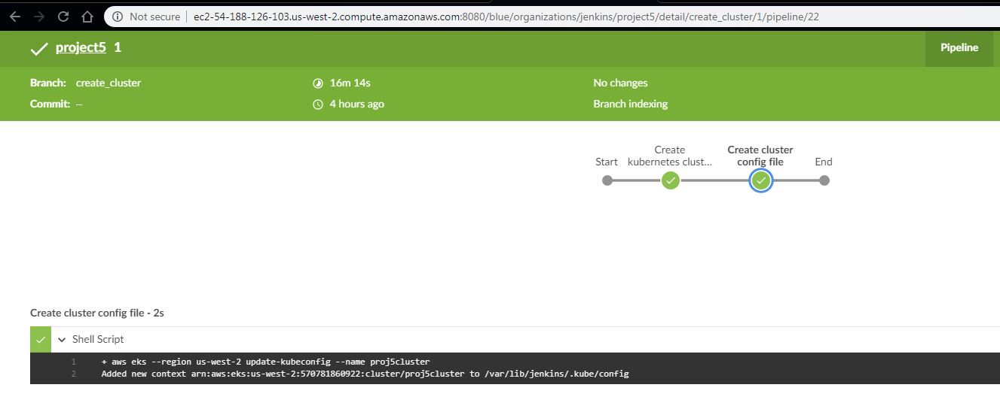

5. CloudFormation cluster

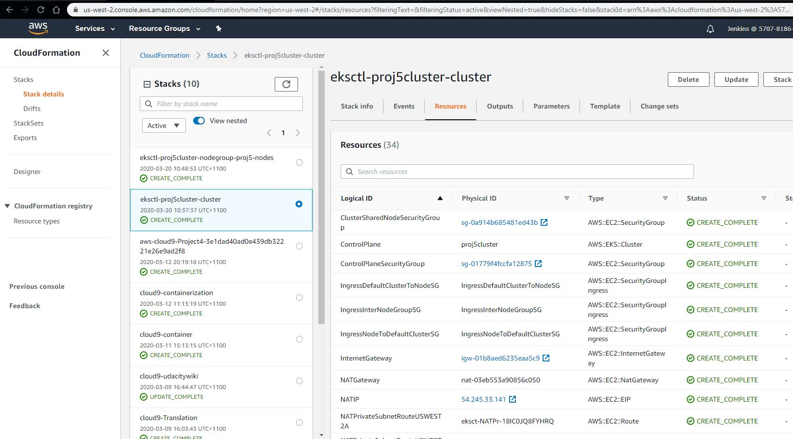

7. CloudFormation nodes

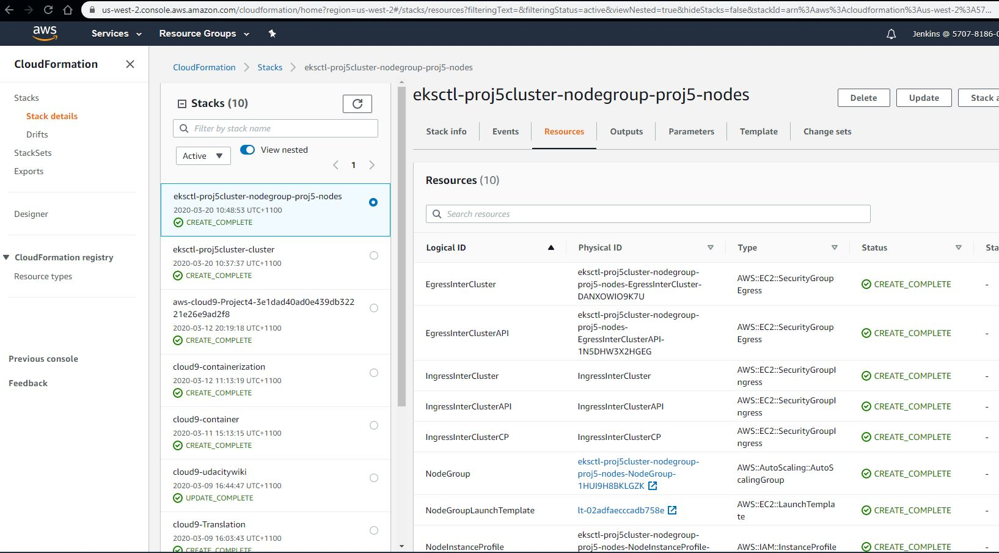

8. Instance load balance

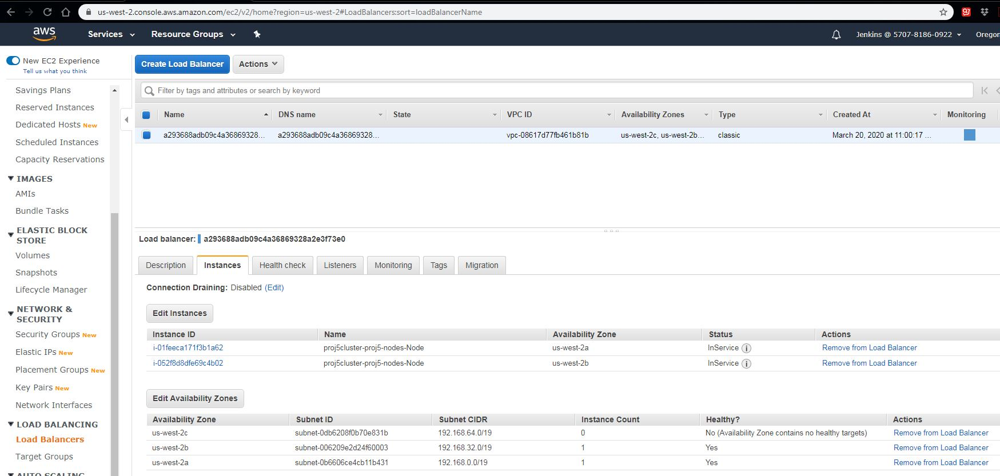

9. Lint check index.html

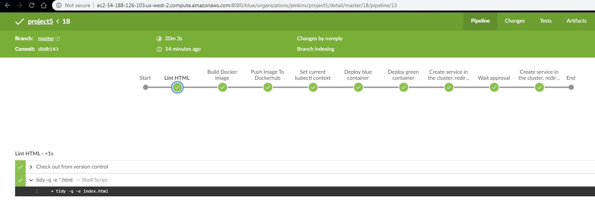

10. Build docker image

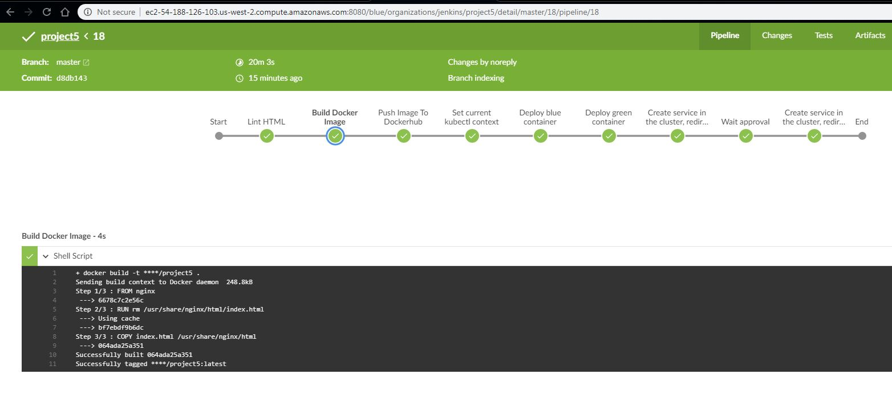

11. Push docker image to docker.io

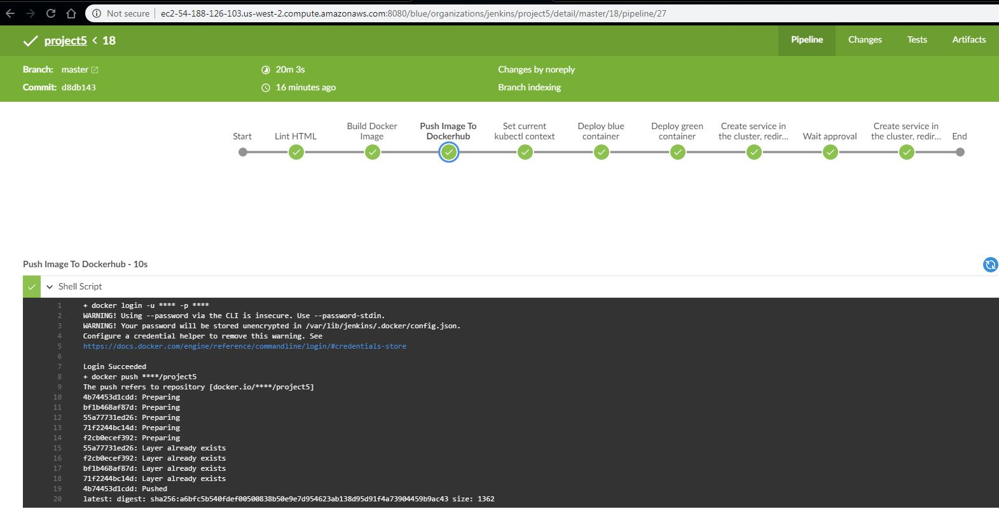

12. Image uploaded

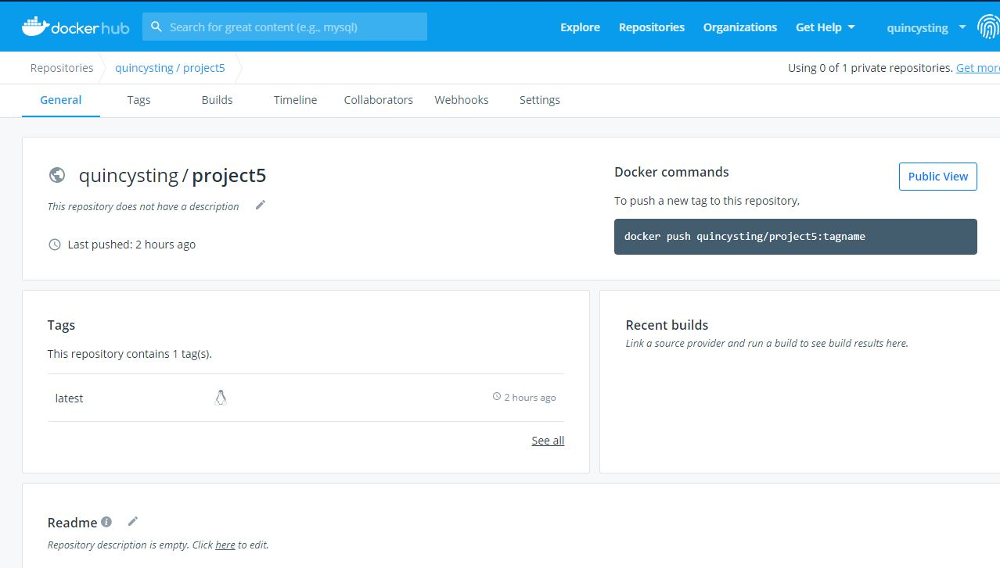

13. Set EKS context to cluster arn:aws:eks:us-west-2:570781860922:cluster/proj5cluster

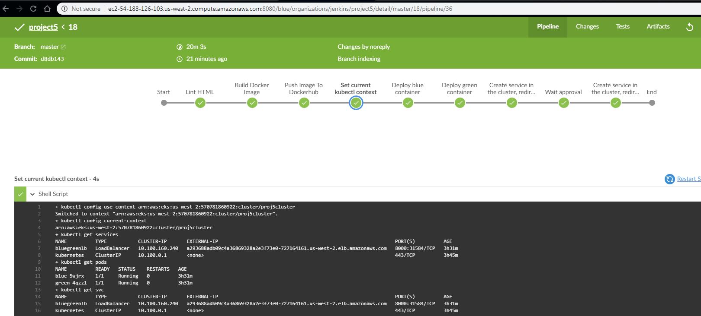

14. Deploy blue container

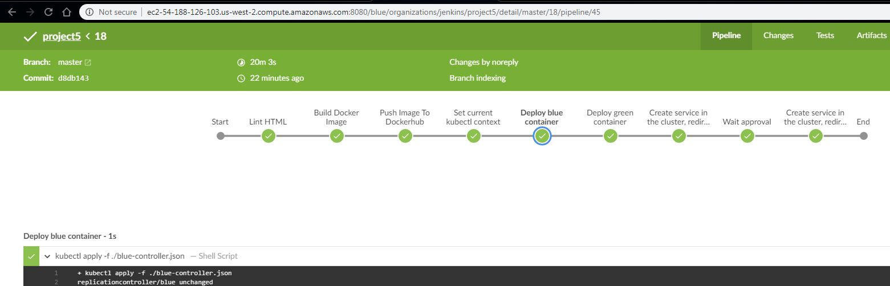

15. Deploy green container

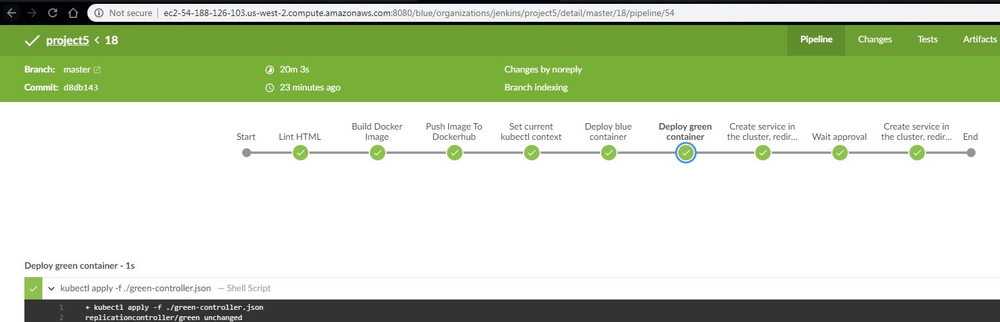

16. Create service in container

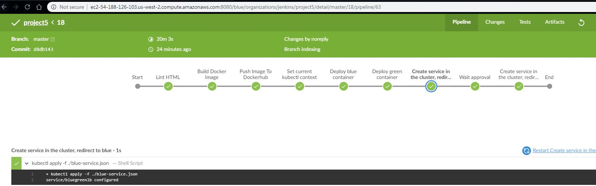

17. Wait for user approal to change over to green 

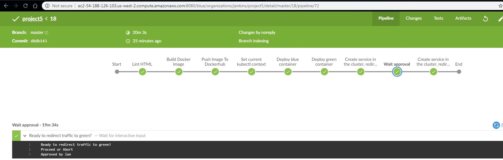

18. Redirect to green 

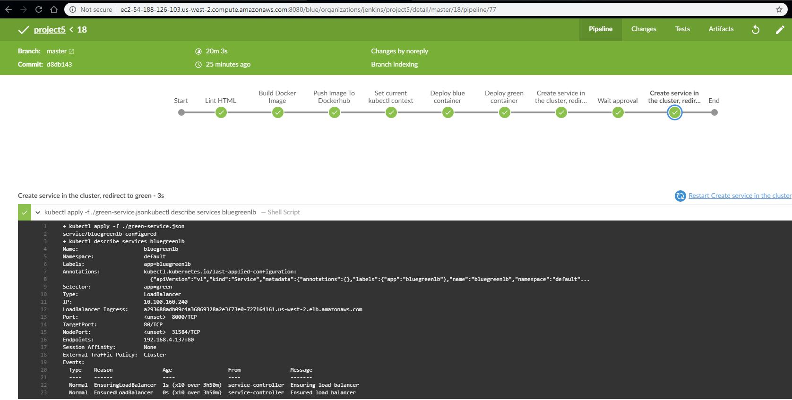

19. Run "kubectl get services"

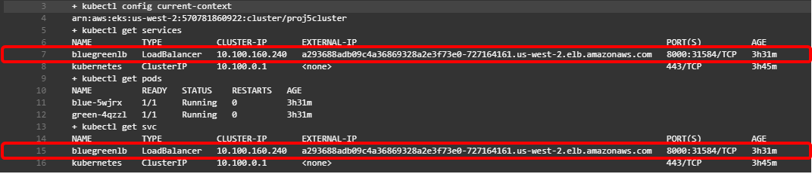

20. Run "kubectl describe services bluegreenlb" to check service

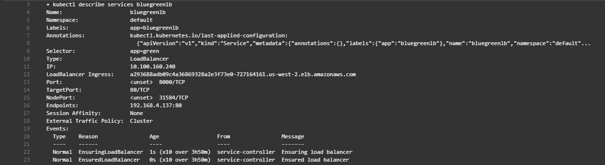

21. Test service http://a293688adb09c4a36869328a2e3f73e0-727164161.us-west-2.elb.amazonaws.com:8000/

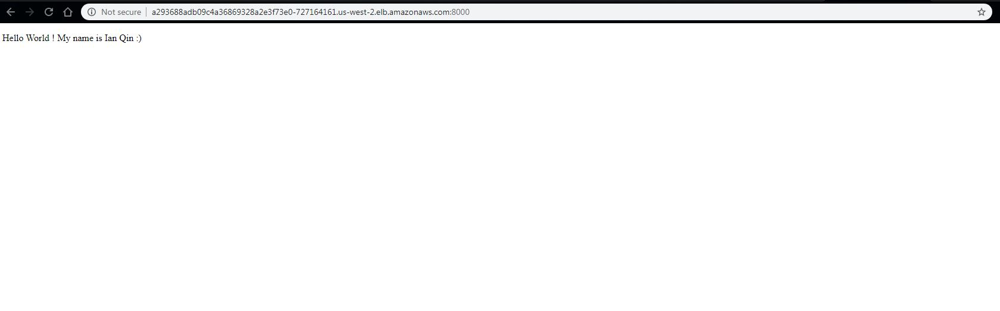

